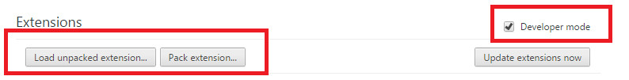

### Simple Bookmark Checker Chrome Extension

##### Functionality
- This bookmark checker will search the **bookmarked pages** from the current domain. Like- If you are in quora.com and click this extension button , It will show all other bookmarked page from quora.com. 
- List View of the related bookmared pages will show **Title** of the bookmark, **link** of that bookmark and **Remove** button.
- Clicking on any link in the list will open that link in a new tab. 
- Clicking on **Remove** button will remove that link from bookmarks at instance. No need to go to that page from bookmark manager. 

### Installation

- Download the repository on you local machine.
- From Chrome settings->Extension page *check* the **Developer mode** and you will find a button **load unpacked extension**. Like below:

- Click that button and show the root of this repository (unzipped).

**And you are done.**

License
----

MIT